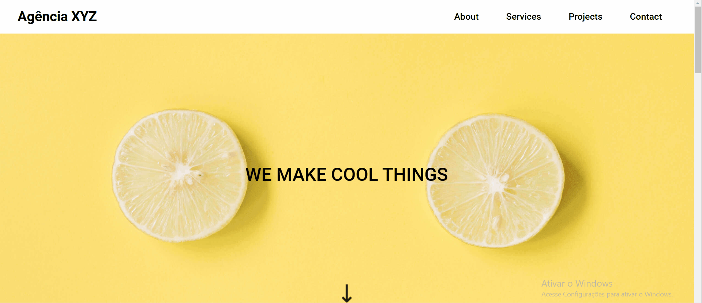
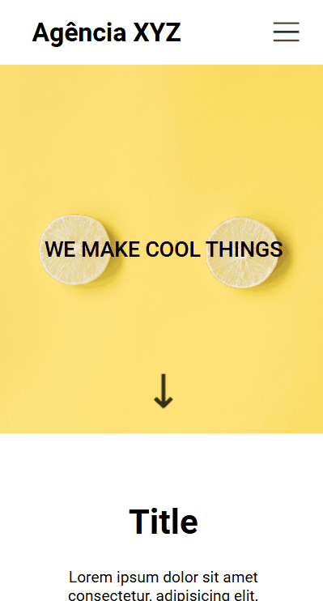

# Landing page agência

## 🧩 Uma landing page de agência de serviços

Esse projeto foi criado por um curso  de extensão universitária, o DevQuest. Se trata de uma landing page de uma agência de serviços adaptável para qualquer tipo de tela.

## 💻 Design desktop



## 📱 Design mobile




## 🚀 Tecnologias utilizdas

- HTML
- CSS

## 🔗 Clone o projeto

````
https://github.com/Ezequiel-Bomfim/Landing-page-agencia.git
````
````
git@github.com:Ezequiel-Bomfim/Landing-page-agencia.git
````

## 🗻 Desafios

Na criação desse projeto tiveram muitos desafios e aqui vão alguns deles ⬇️.

- Dividir o layout em colunas e linhas com display grid.

- Criar o menu hambúguer.

- Criar a animação da seta.

## 🧑🏽‍💻 Coisas que aprendi

Durante esse procecesso de criação do projeto eu consegiur evoluir um pouco mais minhas habilidades e aqui vão algumas delas ⬇️.

- Aprendi mais sobre o display grid.

- Aprendi a criar um menu hambúguer.

- Aprendi a criar animações.

- Aprendi a usar os botões pra mandar o usuário pra cada seção do site.

## 🎯 Desenvolvimwento contínuo

Quero me desenvolver cada vez mais, sempre evoluindo minhas habilidades e enfrentando desafios maiores com o passar do tempo para me tornar um desenvolvedor de qualidade.

## 🙏 Agradecimentos

Venho agradecer a toda equipe do DevQuest por todo apoio e aprendizado. 
